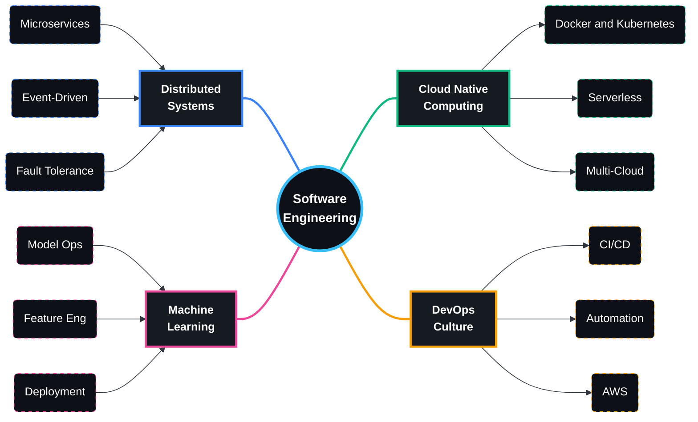
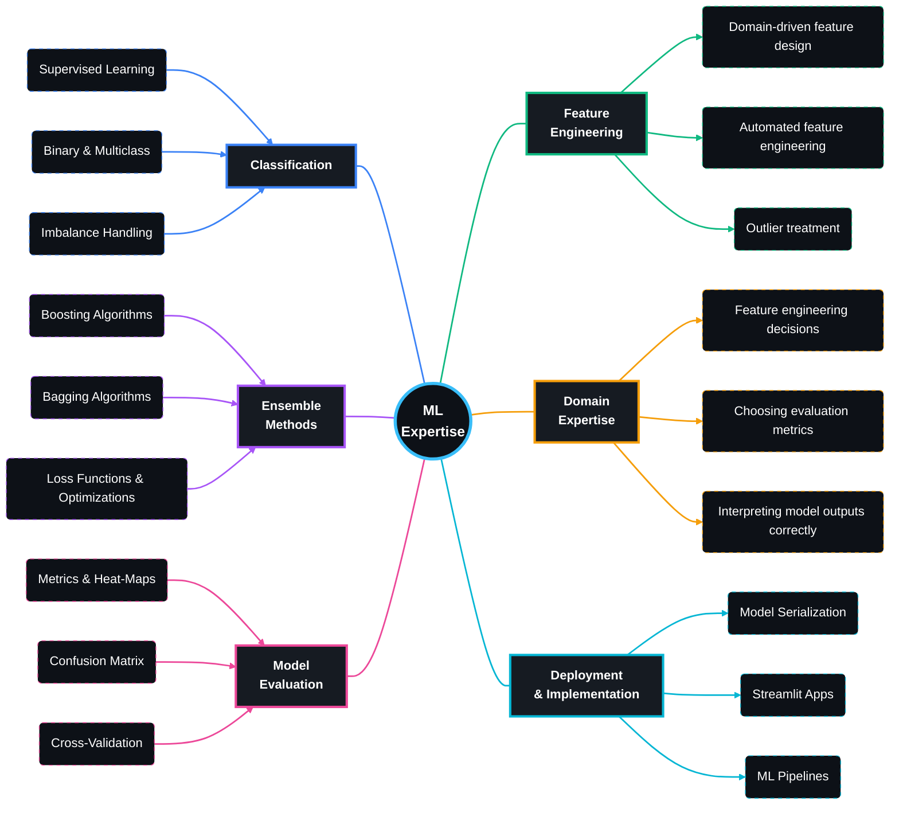

<div align="center">

<!-- Animated Header Wave with Gradient -->


</div>

<!-- Dynamic Typing Effect with Multiple Lines -->
<p align="center">
  <a href="https://git.io/typing-svg">
    
  </a>
</p>

<!-- Animated Social Badges with Professional Styling -->
<p align="center">
  <a href="https://www.linkedin.com/in/ayushdayal8" target="_blank">
    
  </a>
  <a href="mailto:ayushdayal900@gmail.com">
    
  </a>
  <a href="https://github.com/ayushdayal900" target="_blank">
    
  </a>
  <a href="https://personal-portfolio-three-sigma-94.vercel.app/" target="_blank">
    
  </a>
</p>

<br/>

<hr style="border: none; border-top: 2px solid white; width: 50%; margin: 20px auto;">

<br/>

## 🌟 About Me


```javascript
const ayushDayal = {
  role: "Software Engineer",
  location: "India 🇮🇳",
  timezone: "Asia/Kolkata (UTC+5:30)",
  
  currentFocus: {
    learning: ["Vue.js", "Node.js", "Advanced Linux"],
    building: "Scalable Web Applications",
    exploring: "Cloud-Native Architectures",
    researching: "ML & IPO Prediction Systems"
  },
  
  specializations: [
    "Full-Stack Development",
    "Systems Programming",
    "Cloud Infrastructure",
    "API Design & Architecture",
    "Machine Learning Integration"
  ],
  
  workingOn: {
    primary: "Open Source Contributions",
    secondary: "IPO Automation Platform",
    tertiary: "Personal Projects Portfolio",
    research: "Modern Web Performance & ML"
  },
  
  education: {
    degree: "Third-Year College Student",
    focus: ["Mathematics", "Statistics", "ML"]
  },
  
  funFact: "I believe great documentation is as important as great code!",
  
  availability: {
    openSource: true,
    consulting: true,
    mentorship: true,
    freelance: true,
    collaboration: "Let's build something amazing together! ✨"
  },
  
  skills: {
    languages: ["JavaScript", "Python", "Java", "C++", "Bash"],
    frontend: ["Vue.js", "React", "TailwindCSS", "Bootstrap"],
    backend: ["Node.js", "Flask", "Django", "Express"],
    databases: ["MongoDB", "PostgreSQL", "MySQL", "Firebase"],
    cloud: ["AWS", "Azure", "Docker", "Kubernetes"],
    tools: ["Git", "VS Code", "Postman", "Figma"]
  }
};

// Life philosophy
console.log("Code with passion, document with purpose 💙");
console.log(`${ayushDayal.role} ready to collaborate! 🚀`);
```

<br clear="right"/>

### 🎯 What I Do Best

<div align="center">

| 🌐 **Web Development** | 🖥️ **Systems Programming** | ☁️ **Cloud & DevOps** | 🚀 **Current Focus** |
|:---:|:---:|:---:|:---:|
| Full-stack applications with modern frameworks(MERN/MEVN) | Linux system administration, automation & security workflows | Complete AWS, Docker, Basics of Azure, GCP and Kubernetes | Machine Learning mastery |
| RESTful API architecture & microservices design | Shell scripting for deployment, tooling & task automation | Infrastructure as Code (IaC) | Backend deployment |
| Database engineering, optimization & schema management | Process, memory & file system management (OS-level programming) | CI/CD pipeline by GitHub Actions, Jenkins | Open Source Contributions |
| Responsive UI/UX development with Figma and Power BI | System performance tuning, monitoring & optimization | Cloud-native deployment Docker, Kubernetes and Terraform | ML model integration & deployment |

</div>

<br/>
### 🎯 My Best Projects


| Project                    | Description                                                                                  | Tech Stack                                                        | Status                |
| -------------------------- | -------------------------------------------------------------------------------------------- | ----------------------------------------------------------------- | --------------------- |
| **FalcoVita**              | Application designed for streamline healthcare operations by providing a centralized platform for managing patients, doctors, appointments, and medical records. | Vue.js, Flask, SQLite, Celery, Redis, MailHog, OpenAI, Pinecone, Bootstrap | 🟢 Completed          |
| **Quiz-Master**            | A web-based quiz management system developed to facilitate quiz creation and track student learning progress.                          | Flask, HTML, CSS, JavaScript, Bootstrap, Jinja, Matplotlib                    | 🟢 Completed          |
| **Eventizer**              | Full-stack event management system with scheduling, real-time virtual events & notifications | React.js, Node.js, Express, MongoDB, Jitsi Meet, Discord Webhook    | 🟢 Completed          |
| **IPO Predictor**          | ML-based prediction system for IPO performance with structured analysis pipeline             | Python, ML Models, Boosting Algorithms, Imbalanced Data Handling  | 🟢 Completed |
| **Causal Bias Mitigation** | Applied causal inference to analyze & mitigate AI/ML prediction bias                         | Python, PyTorch, TensorFlow, HuggingFace, OpenAI                  | 🟢 Completed |

</div>

<br/>

<!-- Premium Animated Divider -->
<hr style="border: none; border-top: 2px solid white; width: 50%; margin: 20px auto;">

<br/>

## 💻 Tech Stack & Tools

<details open>
<summary><b>🔤 Programming Languages</b></summary>
<br/>

<p align="center">
  
</p>


</details>

<details open>
<summary><b>🎨 Frontend Technologies</b></summary>
<br/>

<p align="center">
  
</p>


</details>

<details open>
<summary><b>⚙️ Backend & Frameworks</b></summary>
<br/>

<p align="center">
  
</p>


</details>

<details open>
<summary><b>🗄️ Database Systems</b></summary>
<br/>

<p align="center">
  
</p>


</details>

<details open>
<summary><b>☁️ Cloud & DevOps</b></summary>
<br/>

<p align="center">
  
</p>


</details>

<details open>
<summary><b>🤖 Machine Learning & Data Science</b></summary>
<br/>

<p align="center">
  
</p>


</details>

<details open>
<summary><b>🎨 Design & Productivity</b></summary>
<br/>

<p align="center">
  
</p>

</details>

<br/>

<!-- Premium Animated Divider -->
<hr style="border: none; border-top: 2px solid white; width: 50%; margin: 20px auto;">

<br/>


### 📅 Contribution Activity Graph

<a href="https://github.com/ayushdayal900">
  
</a>

### 📌 Detailed Profile Summary
<p align="center">
  
</p>

<table align="center">
  <tr>
    <td></td>
    <td></td>
  </tr>
  <tr>
    <td></td>
    <td></td>
  </tr>
</table>

### 📊 Advanced Metrics

<p align="center">
  
</p>

</div>

<br/>

<!-- Premium Animated Divider -->
<hr style="border: none; border-top: 2px solid white; width: 50%; margin: 20px auto;">

<br/>

## 🎓 Professional Philosophy & Values

<div align="center">

<table>
<tr>
<td align="center" width="25%">
<br/>
<b>Technical Excellence</b><br/>
<sub>Writing clean, maintainable, and efficient code</sub><br/>
<sub>⭐ Following best practices</sub>
</td>
<td align="center" width="25%">
<br/>
<b>Continuous Learning</b><br/>
<sub>Staying ahead with emerging technologies</sub><br/>
<sub>📚 Always expanding skillset</sub>
</td>
<td align="center" width="25%">
<br/>
<b>Knowledge Sharing</b><br/>
<sub>Contributing to the open source community</sub><br/>
<sub>🤝 Helping others grow</sub>
</td>
<td align="center" width="25%">
<br/>
<b>Problem Solving</b><br/>
<sub>Analytical thinking and innovative solutions</sub><br/>
<sub>💡 Creative approaches</sub>
</td>
</tr>
</table>

### 💭 Core Belief

> *"Documentation is not a burden—it is an investment in clarity, maintainability, and collaborative success."*


</div>

### 🎯 Strategic Focus Areas


## 💻 Software Engineering Expertise 




## 🤖 Machine Learning Expertise 



<br/>

<!-- Premium Animated Divider -->
<hr style="border: none; border-top: 2px solid white; width: 50%; margin: 20px auto;">

<br/>

## 🤝 Let's Connect & Collaborate

<div align="center">

### 💼 Open for Opportunities

<table>
<tr>
<td align="center" width="33%">
<br/>
<b>🌟 Open Source</b><br/>
<sub>Contributing to Java projects and beyond</sub><br/>
<sub>Building tools that empower developers</sub><br/>
<sub>Passionate about community-driven development</sub>
</td>
<td align="center" width="33%">
<br/>
<b>💡 Technical Consulting</b><br/>
<sub>Architecture design & code review</sub><br/>
<sub>Performance optimization strategies</sub><br/>
<sub>Best practices implementation</sub>
</td>
<td align="center" width="33%">
<br/>
<b>🚀 Collaboration</b><br/>
<sub>Let's build innovative solutions together</sub><br/>
<sub>Web apps, APIs, or cloud infrastructure</sub><br/>
<sub>ML integration and automation</sub>
</td>
</tr>
</table>


<p align="center">
  
  
  
  
</p>

### ☕ Support My Work

<p align="center">
  <b>If you find my projects helpful or enjoy my work, consider supporting me!</b>
</p>

<p align="center">
  <a href="https://github.com/ayushdayal900?tab=repositories" target="_blank">
    
  </a>
  <a href="https://github.com/ayushdayal900?tab=followers" target="_blank">
    
  </a>
  <a href="https://www.linkedin.com/in/ayush-dayal-0bb221242/" target="_blank">
    
  </a>
</p>

</div>

<br/>

<!-- Premium Animated Divider -->
<hr style="border: none; border-top: 2px solid white; width: 50%; margin: 20px auto;">

<br/>

## 💡 Random Dev Wisdom

<div align="center">


</div>

<br/>

<!-- Premium Animated Divider -->
<hr style="border: none; border-top: 2px solid white; width: 50%; margin: 20px auto;">

<br/>

<!-- Footer Section with Enhanced Design -->
<div align="center">


---

<table align="center">
<tr>
<td align="center" width="100%">

**© 2025 Ayush Dayal** | **All Rights Reserved**

*Software Engineer • Full-Stack Developer • Open Source Contributer • Systems Architect • ML Enthusiast • Lifelong Learner*


</td>
</tr>
</table>


</div>

