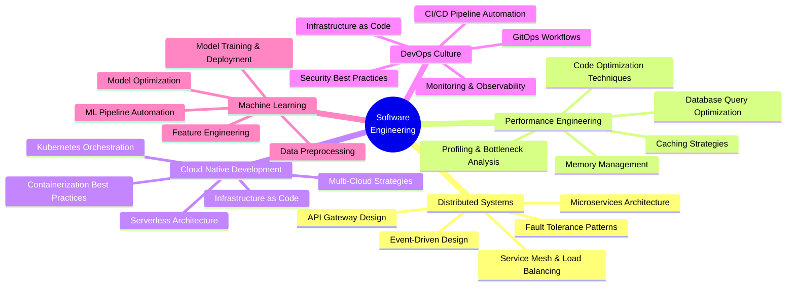

<!-- 
╔═══════════════════════════════════════════════════════════════════════════════╗
║                     AYUSH DAYAL - GITHUB PROFILE README                       ║
║                  Crafted with precision and passion 💙                        ║
╚═══════════════════════════════════════════════════════════════════════════════╝
-->

<div align="center">

<!-- Animated Header Wave with Gradient -->


</div>

<!-- Dynamic Typing Effect with Multiple Lines -->
<p align="center">
  <a href="https://git.io/typing-svg">
    
  </a>
</p>

<!-- Animated Social Badges with Professional Styling -->
<p align="center">
  <a href="https://www.linkedin.com/in/ayushdayal8" target="_blank">
    
  </a>
  <a href="mailto:ayushdayal900@gmail.com">
    
  </a>
  <a href="https://github.com/ayushdayal900" target="_blank">
    
  </a>
  <a href="https://personal-portfolio-three-sigma-94.vercel.app/" target="_blank">
    
  </a>
</p>

<!-- Enhanced Profile Statistics with Custom Colors -->
<p align="center">
  
  

</p>

<br/>

<hr style="border: none; border-top: 2px solid white; width: 50%; margin: 20px auto;">

<br/>

## 🌟 About Me


<p align="center">


</p>


```javascript
const ayushDayal = {
  role: "Software Engineer",
  location: "India 🇮🇳",
  timezone: "Asia/Kolkata (UTC+5:30)",
  
  currentFocus: {
    learning: ["Vue.js", "Node.js", "Advanced Linux"],
    building: "Scalable Web Applications",
    exploring: "Cloud-Native Architectures",
    researching: "ML & IPO Prediction Systems"
  },
  
  specializations: [
    "Full-Stack Development",
    "Systems Programming",
    "Cloud Infrastructure",
    "API Design & Architecture",
    "Machine Learning Integration"
  ],
  
  workingOn: {
    primary: "Open Source Contributions",
    secondary: "IPO Automation Platform",
    tertiary: "Personal Projects Portfolio",
    research: "Modern Web Performance & ML"
  },
  
  education: {
    degree: "Third-Year College Student",
    focus: ["Mathematics", "Statistics", "ML"]
  },
  
  funFact: "I believe great documentation is as important as great code!",
  
  availability: {
    openSource: true,
    consulting: true,
    mentorship: true,
    freelance: true,
    collaboration: "Let's build something amazing together! ✨"
  },
  
  skills: {
    languages: ["JavaScript", "Python", "Java", "C++", "Bash"],
    frontend: ["Vue.js", "React", "TailwindCSS", "Bootstrap"],
    backend: ["Node.js", "Flask", "Django", "Express"],
    databases: ["MongoDB", "PostgreSQL", "MySQL", "Firebase"],
    cloud: ["AWS", "Azure", "Docker", "Kubernetes"],
    tools: ["Git", "VS Code", "Postman", "Figma"]
  }
};

// Life philosophy
console.log("Code with passion, document with purpose 💙");
console.log(`${ayushDayal.role} ready to collaborate! 🚀`);
```

<br clear="right"/>

### 🎯 What I Do Best

<div align="center">

| 🌐 **Web Development** | 🖥️ **Systems Programming** | ☁️ **Cloud & DevOps** | 🚀 **Current Focus** |
|:---:|:---:|:---:|:---:|
| Full-stack applications with modern frameworks | Linux system administration & automation | AWS, Azure, Docker, Kubernetes | Vue.js ecosystem mastery |
| RESTful API design & microservices | Shell scripting & task automation | Infrastructure as Code (IaC) | Node.js backend development |
| Database optimization & architecture | Containerization strategies | CI/CD pipeline automation | Java open source contributions |
| Responsive UI/UX design | Performance tuning & monitoring | Cloud-native deployment | ML model integration & deployment |

</div>

### 📚 Recent Projects & Research

<div align="center">

| Project | Description | Tech Stack | Status |
|---------|-------------|------------|--------|
| **IPO Automation Platform** | ML-powered IPO prediction & automated application system | Python, Flask, ML, AWS | 🟢 Active |
| **Calorie Calculator** | Industry project for health tracking & nutrition analysis | React, Node.js, MongoDB | 🟢 Complete |
| **Phishing Detection** | Browser extension for real-time phishing detection | JavaScript, ML Models | 🟡 In Progress |
| **Research Papers** | IPO prediction, SPC & DOE for quality improvement | Python, Statistics, IEEE | 🟢 Published |

</div>

<br/>

<!-- Premium Animated Divider -->
<hr style="border: none; border-top: 2px solid white; width: 50%; margin: 20px auto;">

<br/>

## 💻 Tech Stack & Tools

<details open>
<summary><b>🔤 Programming Languages</b></summary>
<br/>

<p align="center">
  
</p>


</details>

<details open>
<summary><b>🎨 Frontend Technologies</b></summary>
<br/>

<p align="center">
  
</p>


</details>

<details open>
<summary><b>⚙️ Backend & Frameworks</b></summary>
<br/>

<p align="center">
  
</p>


</details>

<details open>
<summary><b>🗄️ Database Systems</b></summary>
<br/>

<p align="center">
  
</p>


</details>

<details open>
<summary><b>☁️ Cloud & DevOps</b></summary>
<br/>

<p align="center">
  
</p>


</details>

<details open>
<summary><b>🤖 Machine Learning & Data Science</b></summary>
<br/>

<p align="center">
  
</p>


</details>

<details open>
<summary><b>🎨 Design & Productivity</b></summary>
<br/>

<p align="center">
  
</p>

</details>

<br/>

<!-- Premium Animated Divider -->
<hr style="border: none; border-top: 2px solid white; width: 50%; margin: 20px auto;">

<br/>

## 📊 GitHub Statistics

<div align="center">

### 📈 Overview & Language Distribution

<a href="https://github.com/ayushdayal900">
  
  
</a>

### 🔥 Contribution Streak

<a href="https://github.com/ayushdayal900">
  
</a>

### 📅 Contribution Activity Graph

<a href="https://github.com/ayushdayal900">
  
</a>

### 🏆 GitHub Trophies & Achievements

<p align="center">
  
</p>

### 📌 Detailed Profile Summary

<p align="center">
  
</p>

<table align="center">
  <tr>
    <td></td>
    <td></td>
  </tr>
  <tr>
    <td></td>
    <td></td>
  </tr>
</table>

### 📊 Advanced Metrics

<p align="center">
  
</p>

</div>

<br/>

<!-- Premium Animated Divider -->
<hr style="border: none; border-top: 2px solid white; width: 50%; margin: 20px auto;">

<br/>

## 🎓 Professional Philosophy & Values

<div align="center">

<table>
<tr>
<td align="center" width="25%">
<br/>
<b>Technical Excellence</b><br/>
<sub>Writing clean, maintainable, and efficient code</sub><br/>
<sub>⭐ Following best practices</sub>
</td>
<td align="center" width="25%">
<br/>
<b>Continuous Learning</b><br/>
<sub>Staying ahead with emerging technologies</sub><br/>
<sub>📚 Always expanding skillset</sub>
</td>
<td align="center" width="25%">
<br/>
<b>Knowledge Sharing</b><br/>
<sub>Contributing to the open source community</sub><br/>
<sub>🤝 Helping others grow</sub>
</td>
<td align="center" width="25%">
<br/>
<b>Problem Solving</b><br/>
<sub>Analytical thinking and innovative solutions</sub><br/>
<sub>💡 Creative approaches</sub>
</td>
</tr>
</table>

### 💭 Core Belief

> *"Documentation is not a burden—it is an investment in clarity, maintainability, and collaborative success."*


</div>

### 🎯 Strategic Focus Areas



<table>
<tr>
<td width="50%" valign="top">

#### 🏗️ Distributed Systems Architecture
- 🔹 Designing scalable microservices ecosystems
- 🔹 Implementing fault-tolerant communication patterns
- 🔹 Event-driven architecture and message queues
- 🔹 Service discovery and load balancing strategies
- 🔹 API gateway design and rate limiting

#### ⚡ Performance Optimization
- 🔹 Application profiling and performance tuning
- 🔹 Database query optimization and indexing
- 🔹 Caching strategies (Redis, CDN, browser)
- 🔹 Code-level optimization and refactoring
- 🔹 Memory leak detection and resolution

#### 🤖 Machine Learning Integration
- 🔹 ML model training and deployment
- 🔹 Feature engineering for financial data
- 🔹 IPO prediction system development
- 🔹 Automated ML pipeline creation
- 🔹 Model monitoring and optimization

</td>
<td width="50%" valign="top">

#### ☁️ Cloud-Native Design
- 🔹 Container orchestration with Kubernetes
- 🔹 Serverless computing and FaaS patterns
- 🔹 Multi-cloud deployment strategies
- 🔹 Cloud cost optimization techniques
- 🔹 High availability and disaster recovery

#### 🔄 DevOps Automation
- 🔹 CI/CD pipeline engineering
- 🔹 Infrastructure as Code (Terraform, CloudFormation)
- 🔹 Automated testing and deployment
- 🔹 Monitoring, logging, and alerting systems
- 🔹 Security scanning and compliance

#### 📊 Full-Stack Excellence
- 🔹 Modern JavaScript frameworks (Vue, React)
- 🔹 RESTful & GraphQL API design
- 🔹 Progressive Web Apps (PWA)
- 🔹 Real-time communication (WebSockets)
- 🔹 Responsive and accessible UI design

</td>
</tr>
</table>

<br/>

<!-- Premium Animated Divider -->
<hr style="border: none; border-top: 2px solid white; width: 50%; margin: 20px auto;">

<br/>

## 🤝 Let's Connect & Collaborate

<div align="center">

### 💼 Open for Opportunities

<table>
<tr>
<td align="center" width="33%">
<br/>
<b>🌟 Open Source</b><br/>
<sub>Contributing to Java projects and beyond</sub><br/>
<sub>Building tools that empower developers</sub><br/>
<sub>Passionate about community-driven development</sub>
</td>
<td align="center" width="33%">
<br/>
<b>💡 Technical Consulting</b><br/>
<sub>Architecture design & code review</sub><br/>
<sub>Performance optimization strategies</sub><br/>
<sub>Best practices implementation</sub>
</td>
<td align="center" width="33%">
<br/>
<b>🚀 Collaboration</b><br/>
<sub>Let's build innovative solutions together</sub><br/>
<sub>Web apps, APIs, or cloud infrastructure</sub><br/>
<sub>ML integration and automation</sub>
</td>
</tr>
</table>

### 📬 Get in Touch

<p align="center">
  <a href="https://www.linkedin.com/in/ayush-dayal-0bb221242/" target="_blank">
    
  </a>
  <a href="mailto:ayushdayal900@gmail.com">
    
  </a>
  <a href="https://github.com/ayushdayal900" target="_blank">
    
  </a>
  <a href="https://twitter.com" target="_blank">
    
  </a>
</p>

<p align="center">
  
  
  
  
</p>

### ☕ Support My Work

<p align="center">
  <b>If you find my projects helpful or enjoy my work, consider supporting me!</b>
</p>

<p align="center">
  <a href="https://github.com/ayushdayal900?tab=repositories" target="_blank">
    
  </a>
  <a href="https://github.com/ayushdayal900?tab=followers" target="_blank">
    
  </a>
  <a href="https://www.linkedin.com/in/ayush-dayal-0bb221242/" target="_blank">
    
  </a>
  <a href="https://github.com/sponsors" target="_blank">
    
  </a>
</p>

### 🌐 Professional Network

<p align="center">
  <a href="https://stackoverflow.com" target="_blank">
    
  </a>
  <a href="https://dev.to" target="_blank">
    
  </a>
  <a href="https://medium.com" target="_blank">
    
  </a>
  <a href="https://hashnode.com" target="_blank">
    
  </a>
</p>

</div>

<br/>

<!-- Premium Animated Divider -->
<hr style="border: none; border-top: 2px solid white; width: 50%; margin: 20px auto;">

<br/>

## 💡 Random Dev Wisdom

<div align="center">


### 📝 Latest Blog Posts

<!-- BLOG-POST-LIST:START -->
- 🚀 Building Scalable Microservices with Node.js
- 💡 Best Practices for Vue.js Component Design
- ☁️ Deploying Containerized Apps on Kubernetes
- 🤖 Introduction to Machine Learning in Finance
- 📊 Optimizing Database Performance for Web Apps
<!-- BLOG-POST-LIST:END -->

### 🎯 2025 Goals

<table align="center">
<tr>
<td align="center" width="33%">
<b>🎓 Learning</b><br/>
<sub>Master Kubernetes & Cloud Native</sub><br/>
<sub>Advanced ML & Deep Learning</sub><br/>
<sub>System Design Patterns</sub>
</td>
<td align="center" width="33%">
<b>🚀 Building</b><br/>
<sub>Complete IPO Automation Platform</sub><br/>
<sub>Publish 3 Research Papers</sub><br/>
<sub>Launch 5 Open Source Projects</sub>
</td>
<td align="center" width="33%">
<b>🤝 Contributing</b><br/>
<sub>100+ Open Source Contributions</sub><br/>
<sub>Mentor 10+ Developers</sub><br/>
<sub>Speak at Tech Conferences</sub>
</td>
</tr>
</table>

</div>

<br/>

<!-- Animated Snake Eating Contributions -->
<div align="center">

### 🐍 Watch the Snake Eat My Contributions!

<picture>
  <source media="(prefers-color-scheme: dark)" srcset="https://raw.githubusercontent.com/ayushdayal900/ayushdayal900/output/github-contribution-grid-snake-dark.svg">
  <source media="(prefers-color-scheme: light)" srcset="https://raw.githubusercontent.com/ayushdayal900/ayushdayal900/output/github-contribution-grid-snake.svg">
  
</picture>

</div>

<br/>

<!-- Premium Animated Divider -->
<hr style="border: none; border-top: 2px solid white; width: 50%; margin: 20px auto;">

<br/>

<!-- Footer Section with Enhanced Design -->
<div align="center">


---

<table align="center">
<tr>
<td align="center" width="100%">

**© 2025 Ayush Dayal** | **All Rights Reserved**

*Software Engineer • Full-Stack Developer • Open Source Advocate • Systems Architect • ML Enthusiast • Lifelong Learner*


<p>


</p>

### 🌟 "Code is poetry written in logic"

<p align="center">
  
  
  
</p>

</td>
</tr>
</table>

### 📊 Quick Stats Summary

<p align="center">
  
  
  
  
</p>

</div>

<!-- 
╔═══════════════════════════════════════════════════════════════════════════════╗
║                     Thank you for visiting my profile! 🙏                     ║
║                  Feel free to explore my repositories below                   ║
║                                                                               ║
║                 "The only way to do great work is to love                     ║
║                  what you do." - Steve Jobs                                   ║
╚═══════════════════════════════════════════════════════════════════════════════╝
-->
