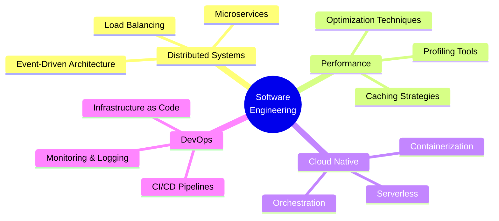

<div align="center">

# 👨‍💻 Ayush Dayal

[](https://git.io/typing-svg)

<p align="center">
  <a href="https://www.linkedin.com/in/ayush-dayal-0bb221242/">
    
  </a>
  <a href="mailto:ayushdayal900@gmail.com">
    
  </a>
  <a href="https://github.com/ayushdayal900">
    
  </a>
</p>

<p align="center">
  
  
  
</p>

</div>


## 📋 Professional Summary

```typescript
const ayushDayal = {
    title: "Software Engineer",
    specialization: ["Full-Stack Development", "Systems Programming"],
    currentFocus: {
        learning: ["Vue.js", "Node.js", "Advanced Linux"],
        building: "Scalable Web Applications",
        exploring: "Cloud-Native Architectures"
    },
    openToCollaborate: true,
    availableFor: ["Java Open Source Projects", "Technical Consulting", "Mentorship"]
};
```

> Software engineer specializing in full-stack web development and systems programming, with demonstrated expertise in building scalable applications and architecting robust solutions. Currently focused on advancing modern JavaScript frameworks and server-side technologies while maintaining a strong foundation in systems-level programming and cloud infrastructure.

<div align="center">
  
  
  
</div>


## 🎯 Technical Expertise

<div align="center">

### Core Competencies

</div>

<table>
<tr>
<td width="50%" valign="top">

#### 🌐 Web Development & Architecture
- ✅ Full-stack application development with modern JavaScript frameworks
- ✅ RESTful API design and microservices architecture
- ✅ Database schema design and query optimization
- ✅ Cloud-native application deployment and scaling

#### 🖥️ Systems Programming & Administration
- ✅ Linux system administration and automation
- ✅ Shell scripting and task automation
- ✅ Containerization and orchestration strategies
- ✅ Infrastructure as Code (IaC) implementation

</td>
<td width="50%" valign="top">

#### 🛠️ Software Engineering Practices
- ✅ Version control and collaborative development workflows
- ✅ Test-driven development and continuous integration
- ✅ Code review and documentation standards
- ✅ Agile methodologies and sprint planning

#### 🚀 Current Development Focus
- 🔄 Vue.js ecosystem and component-based architecture
- 🔄 Node.js proficiency with scalable API development
- 🔄 Advanced Linux system administration workflows
- 🔄 Java open source project contributions

</td>
</tr>
</table>


## 💻 Technology Stack

<div align="center">

### 🔤 Programming Languages


### 🎨 Frontend Technologies


### ⚙️ Backend Technologies & Frameworks


### 🗄️ Database Management Systems


### ☁️ Cloud Infrastructure & DevOps


### 🎨 Design & Productivity Tools


</div>


## 📊 GitHub Analytics

<div align="center">

### 📈 Contribution Metrics

<a href="https://github.com/ayushdayal900">
  
  
</a>

### 🔥 Contribution Streak & Activity

<a href="https://github.com/ayushdayal900">
  
  
</a>

### 🏆 Achievement Showcase

<p align="center">
  
</p>

### 📌 Top Contributed Repositories

<p align="center">
  
</p>

### 📅 Contribution Calendar

<p align="center">
  
</p>

</div>


## 🎓 Professional Philosophy

<div align="center">

### 💭 Guiding Principle

> *"Documentation is not a burden—it is an investment in clarity, maintainability, and collaborative success."*


</div>

<table>
<tr>
<td width="25%" align="center">

<br><strong>Technical Excellence</strong>
<br><sub>Clean, maintainable code</sub>
</td>
<td width="25%" align="center">

<br><strong>Continuous Learning</strong>
<br><sub>Emerging technologies</sub>
</td>
<td width="25%" align="center">

<br><strong>Knowledge Sharing</strong>
<br><sub>Open source contribution</sub>
</td>
<td width="25%" align="center">

<br><strong>Problem Solving</strong>
<br><sub>Analytical thinking</sub>
</td>
</tr>
</table>

### 🎯 Areas of Strategic Interest

<div align="center">



</div>

- 🏗️ **Distributed Systems Architecture** - Scalability patterns and fault tolerance
- ⚡ **Performance Optimization** - Application profiling and bottleneck resolution
- ☁️ **Cloud-Native Design** - Microservices and containerized deployments
- 🔄 **DevOps Automation** - CI/CD pipeline engineering and infrastructure automation


## 🤝 Let's Connect & Collaborate

<div align="center">

### 💼 Open for Opportunities

<table>
<tr>
<td align="center" width="33%">

<br><strong>Open Source</strong>
<br><sub>Contributing to Java projects</sub>
</td>
<td align="center" width="33%">

<br><strong>Technical Consulting</strong>
<br><sub>Architecture & strategy</sub>
</td>
<td align="center" width="33%">

<br><strong>Collaboration</strong>
<br><sub>Building innovative solutions</sub>
</td>
</tr>
</table>

### 📬 Reach Out

<p align="center">
  <a href="https://www.linkedin.com/in/ayush-dayal-0bb221242/">
    
  </a>
  <a href="mailto:ayushdayal900@gmail.com">
    
  </a>
  <a href="https://github.com/ayushdayal900">
    
  </a>
</p>

</div>


## 🌟 Support My Work

<div align="center">

If you find my work valuable, consider:

[](https://github.com/ayushdayal900)
[](https://github.com/ayushdayal900)
[](https://github.com/ayushdayal900)

### ✍️ Random Dev Quote


</div>

---

<div align="center">

### 📊 Profile Statistics


---


**© 2025 Ayush Dayal** • *Open Source Contributor • Systems Architect • Lifelong Learner*

**Made with ❤️ and ☕**

</div>
